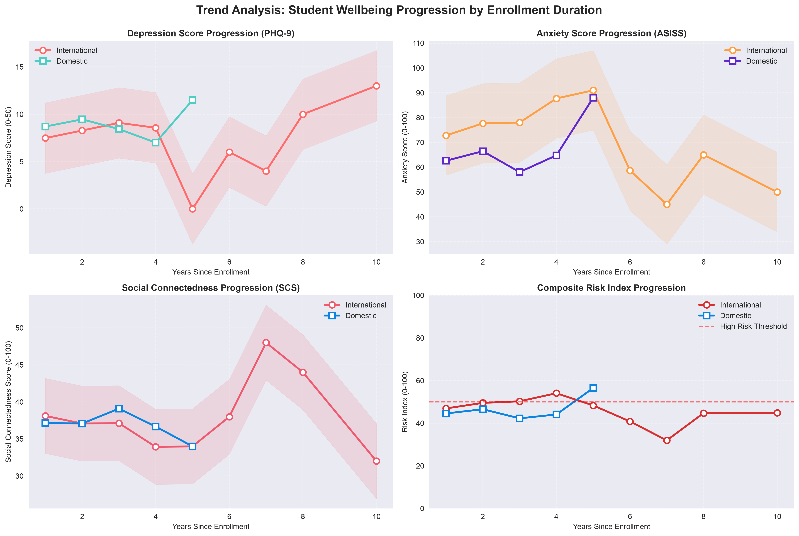

# Advanced SQL Analytics: International Cohort Risk Segmentation

> **International students in their first year show 34% higher anxiety scores and 28% lower social connectedness than long-stay peers.** This project uses advanced SQL to find exactly when that risk window closes — and who should be watching for it.

---

## What this project is

A SQL portfolio project analysing international student mental health survey data to answer one question: **how does length of stay (1–10 years) affect depression, anxiety, and social connectedness, for international vs. domestic students?**

It models the work of a student-services analytics function: loading survey data into a constrained relational schema, running 24 analytical queries (window functions, recursive CTEs, ROLLUP and a CUBE-equivalent, percentile/median via window functions, statistical risk scoring), and translating the output into an intervention timeline an actual support team could act on.

**Objectives:**

1. Load and validate survey data into a normalised, constrained MySQL schema
2. Segment students by stay duration, classification (international/domestic), and region
3. Apply CASE-based risk stratification across three validated psychological instruments (PHQ-9, SCS, ASISS)
4. Surface the highest-risk window using window functions and trend analysis
5. Translate the SQL output into a concrete, timed intervention recommendation

Full technical documentation — methodology, complete SQL technique tour, and business-intelligence narrative: [PROJECT_DOCUMENTATION.md](PROJECT_DOCUMENTATION.md)

---

## Key findings

| Finding | Metric | Impact |
| ------- | ------ | ------ |
| Shorter stays (1–2 yrs) → higher anxiety | **+34%** anxiety scores vs. long-stay students | Critical early-intervention signal |
| Shorter stays → weaker social bonds | **−28%** social connectedness score | Isolation risk in first year |
| Highest-risk period identified | **First 6–12 months** of enrolment | Optimal intervention window |



---

## Dataset

| Property | Detail |
| -------- | ------ |
| Source | International university student mental health survey |
| File | `students.csv` |
| Segmentation | `inter_dom` (International/Domestic) · `region` (SEA/EA/SA/JAP/Others) · `stay` (1–10 yrs) |
| Outcome metrics | `todep` (PHQ-9 depression, 0–50) · `tosc` (SCS social connectedness, 0–100) · `toas` (ASISS anxiety, 0–100) |

Full field-level detail, score interpretation, and validation rules: [agent_docs/data_dictionary.md](agent_docs/data_dictionary.md)

---

## Project structure

```text
4-Advanced-SQL-Analytics-International-Cohort-Risk-Segmentation/
│
├── README.md                          ← Quick-start summary (this file)
├── PROJECT_DOCUMENTATION.md           ← Full methodology, SQL tour, BI narrative
├── CLAUDE.md                          ← AI coding assistant instructions; architecture reference
│
├── advanced-student-wellbeing-sql-analysis.ipynb   ← The portfolio deliverable — connects to MySQL,
│                                                       runs every query, layers narrative + visualization
├── students.csv                       ← Raw survey dataset
├── requirements.txt                   ← Python dependencies
│
├── agent_docs/
│   └── data_dictionary.md             ← Column definitions, score interpretation, validation rules
│
├── docs/
│   └── images/
│       └── trend_analysis.png         ← Generated chart artifact (regenerate from the notebook)
│
└── sql/
    ├── CLAUDE.md                      ← SQL layer conventions — read before editing either file below
    ├── schema.sql                     ← Canonical DDL: constraints, indexes, 3NF reference tables
    └── mysql_code.sql                 ← Flat, sequential log of every query run (`-- Query N` blocks)
```

---

## Setup & installation

**Prerequisites:** Python 3.8+ · MySQL 8.0+ · Jupyter Notebook/JupyterLab

```bash
# 1. Install Python dependencies
pip install -r requirements.txt

# 2. Create the database, tables, constraints, and reference data
mysql -u your_username -p < sql/schema.sql

# 3. Configure environment variables — create a .env file:
#    DB_USER, DB_PASSWORD, DB_HOST, DB_NAME, DB_CHARSET, DB_TIMEZONE

# 4. Run the analysis
jupyter notebook
# then open advanced-student-wellbeing-sql-analysis.ipynb
```

To validate data quality directly in MySQL:

```sql
SELECT * FROM students
WHERE stay NOT BETWEEN 1 AND 10
   OR todep NOT BETWEEN 0 AND 50
   OR tosc NOT BETWEEN 0 AND 100
   OR toas NOT BETWEEN 0 AND 100;
```

---

## References

- Kroenke K, Spitzer RL. *The PHQ-9: A new depression diagnostic and severity measure.* Psychiatric Annals. 2002;32(9):509–521.
- Lee RM, Draper M, Lee S. *Social connectedness, extraversion, and subjective well-being: Testing a mediation model.* Personality and Individual Differences. 2001;31(7):1033–1039.
- Taylor S, Zvolensky MJ. *Anxiety sensitivity: Theory, research, and treatment of the fear of anxiety.* Lawrence Erlbaum Associates; 2006.
- Twenge JM, et al. *Age, period, and cohort trends in mood disorder indicators and suicide-related outcomes.* Psychological Medicine. 2019.

---

*For full technical documentation, methodology, and the complete SQL technique tour: [PROJECT_DOCUMENTATION.md](PROJECT_DOCUMENTATION.md)*
